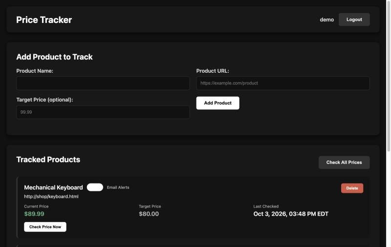
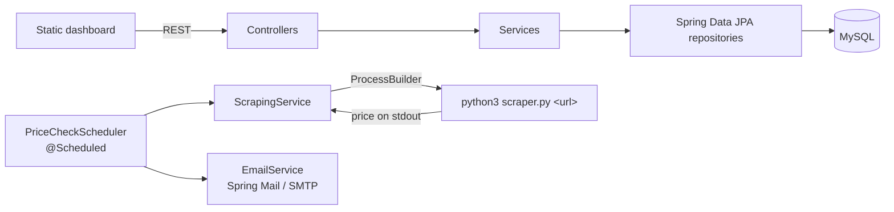

# Price Tracker

A Spring Boot REST API that tracks product prices with a scheduled Python scraper and emails you when a price drops or hits your target.


<!-- TODO: add docs/screenshot.png -->

## What it does
- Register users and add product URLs to track, with an optional target price.
- Re-checks every product on a schedule (hourly by default) and records each price in a history table.
- Emails the owner when the price falls below the last recorded price or reaches the target. Alerts can be toggled per product.
- Includes a small static dashboard (HTML/JS) served by Spring at `/`.

## Tech stack
Java 17 · Spring Boot 3.2 (Web, Data JPA, Validation, Mail, Scheduling) · MySQL 8 · Lombok · Python 3 (Requests, Beautiful Soup) · Docker / Docker Compose

## How it works



- **Layered architecture:** controller → service → repository, with validated DTOs (`@Valid`, `@NotBlank`, `@Email`) at the API boundary, so JPA entities aren't bound directly from request bodies.
- **Java ↔ Python bridge:** `ScrapingService` runs `scraper.py` as a subprocess and reads the price from stdout. Scraping stays in Python (Beautiful Soup), while persistence and scheduling stay in Spring.
- **Scraper strategy:** Amazon gets a site-specific path. Other sites go through CSS price selectors, then JSON-LD (`application/ld+json`), then the `product:price:amount` meta tag. Requests use a retrying session (backoff on 429/5xx).
- **Scheduling & alerts:** `@Scheduled(fixedRateString = "${app.scraping.interval-ms}")` updates prices, then compares the newest price against the previous history entry to decide which emails to send.
- **12-factor config:** DB and SMTP credentials come from environment variables, with placeholders in `application.yml` and `docker-compose.yml`.

## Build & run

### Docker Compose (recommended)
```bash
docker compose up --build
```
This starts MySQL 8 (with a health check) and the app on <http://localhost:8080>. The app image is a multi-stage build: Maven builds the jar, and the runtime image is a JRE with Python and the scraper's dependencies installed.

Set real values through environment variables or a `.env` file next to `docker-compose.yml`:

| Variable | Purpose |
|---|---|
| `MYSQL_ROOT_PASSWORD` / `SPRING_DATASOURCE_PASSWORD` | DB password (defaults to `change-me`) |
| `MAIL_USERNAME` / `MAIL_PASSWORD` | SMTP login (e.g. a Gmail app password) |

Check it's up: `curl localhost:8080/api/health` → `{"service":"Price Tracker API","status":"UP"}`

### Local (without Docker)
Requires Java 17, Maven, Python 3 and a MySQL instance.
```bash
pip install -r python/requirements.txt
mvn spring-boot:run
```

### API

| Method | Endpoint | Description |
|---|---|---|
| `POST` | `/api/users` | Create a user (`username`, `email`, `password`) |
| `GET` | `/api/users/{id}`, `/api/users/email/{email}` | Look up a user |
| `POST` | `/api/products` | Track a product (`name`, `url`, `userId`, optional `targetPrice`) |
| `GET` | `/api/products`, `/api/products/{id}`, `/api/products/user/{userId}` | List / get products |
| `DELETE` | `/api/products/{id}` | Stop tracking |
| `POST` | `/api/products/{id}/check-price` | Scrape one product now |
| `POST` | `/api/products/{id}/toggle-email-notifications` | Turn alerts on/off |
| `POST` | `/api/scraping/check-price`, `/api/scraping/check-all` | Manual scrape triggers |
| `GET` | `/api/health` | Health check |

## Challenges & what I learned
- **Crossing a language boundary:** calling Python from Java with `ProcessBuilder` meant handling exit codes, merged stderr, and parsing failures, and treating "no price found" as a normal outcome instead of a crash.
- **Scraping is brittle:** real product pages change often, so the scraper falls back through several strategies, and a failed scrape for one product doesn't stop the batch.
- **Containerizing a two-runtime app:** one image needs both a JRE and Python. `depends_on` with a MySQL health check stops the app from starting before the database is ready.

**Known limitations / next steps:** passwords are stored in plain text (hashing is a TODO in `UserService`), there's no authentication on the API yet, and there are no automated tests.

## License
[MIT](LICENSE)
